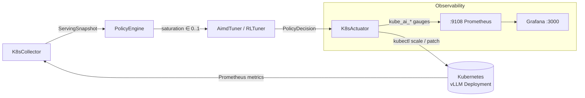
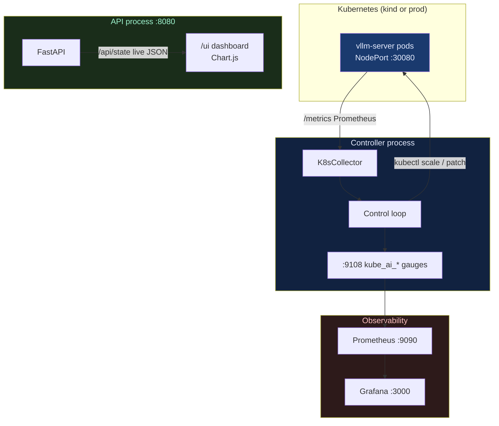

# kube-ai

Kubernetes adaptive control loop that continuously tunes vLLM serving deployments — scaling
replicas **and** adjusting vLLM runtime parameters — in response to live queue pressure, KV-cache
utilization, and TTFT latency.

---

## The problem and the gap

GPU-based LLM inference has two orthogonal degrees of freedom:

1. **Replica count** — how many pods serve traffic.
2. **vLLM runtime knobs** — `--max-num-seqs` (max concurrent sequences), which controls how
   aggressively a single pod saturates GPU memory.

Prior art leaves a gap:

| System | What it tunes | Limitation |
|--------|---------------|-----------|
| **KEDA** | Replicas (event-driven HPA) | No runtime-knob tuning; no composite pressure score |
| **AIBrix** | Replicas + routing | Focused on routing; no `--max-num-seqs` adaptation |
| **Chiron** (arXiv 2501.08090) | Request migration / recomputation under KV pressure | Cluster-internal; not a Kubernetes controller |

**kube-ai** closes this gap: it runs a continuous feedback loop that independently tunes both
replica count **and** `--max-num-seqs` using a composite saturation score computed from live vLLM
Prometheus metrics.  The tuning mode is selectable per operator preference (`TUNE_MODE=replicas |
params | both`).

---

## Architecture

### Control loop: collect → score → tune → actuate



The saturation score is a weighted composite of three vLLM signals:

```
saturation = 0.50 × queue_pressure
           + 0.30 × cache_pressure
           + 0.20 × latency_pressure

where:
  queue_pressure   = waiting / max(1, waiting + running)
  cache_pressure   = vllm:kv_cache_usage_perc          [0..1]
  latency_pressure = clamp((p95_ttft − TTFT_SLO) / TTFT_SLO, 0, 1)

Hard override: if vllm:num_requests_swapped > 0
    saturation = max(saturation, pressure_high + 0.01)
```

Actuator logic (AIMD by default):

| Condition | Replica action | `--max-num-seqs` action |
|-----------|---------------|-------------------------|
| sat ≥ `pressure_high` (0.75) | `+1` (additive increase) | `+128` (additive increase) |
| sat ≤ `pressure_low`  (0.35) | `÷2` (multiplicative decrease) | `÷2` (multiplicative decrease) |
| otherwise | hold | hold |

Both paths are independently cooled down (`cooldown_sec` for replicas, `param_cooldown_sec` for
params) and double-clamped at the tuner and actuator layers.

### Observability topology: mock vs real, Prometheus, Grafana, UI



In `vllm_mode=mock` (default) the collector uses a built-in fixture; no cluster is needed.
In `vllm_mode=real` it scrapes `vllm_metrics_url` and calls `kubectl` via the configured
`exec_mode` (local / ssh / docker).

---

## Quick start

### Local sandbox (kind + mock vLLM)

```bash
# Prerequisites: kind, kubectl, docker, docker compose
git clone <repo-url> kube-ai && cd kube-ai
pip install -e ".[dev]"

# Spin up kind cluster + mock-vLLM + Prometheus + Grafana
./scripts/up.sh

# Start the web UI and API
uvicorn apps.api.main:app --host 127.0.0.1 --port 8080
# Open http://localhost:8080/ui

# Run the controller against the live kind sandbox
cp infra/sandbox.config.yaml config.yaml
python -m controller.main --dry-run false --interval 10

# Grafana
# Open http://localhost:3000  (admin / admin)

# Tear down
./scripts/down.sh
```

### Offline (no cluster)

```bash
pip install -e ".[dev]"
python -m controller.main --dry-run true --interval 1 --max-iterations 3
```

---

## Configuration

All values can be set in `config.yaml` (YAML key) or as environment variables (ENV column).
Environment overrides YAML; YAML overrides hardcoded defaults.

| Key | ENV | Default | Description |
|-----|-----|---------|-------------|
| `tune_mode` | `TUNE_MODE` | `both` | `replicas` — scale pods only; `params` — tune `--max-num-seqs` only; `both` — both |
| `dry_run` | `CONTROLLER_DRY_RUN` | `true` | Log decisions without calling kubectl |
| `interval_sec` | `CONTROLLER_INTERVAL_SEC` | `30` | Seconds between control ticks |
| `min_replicas` | `MIN_REPLICAS` | `1` | Replica lower bound (≥ 1; scale-to-zero prevented) |
| `max_replicas` | `MAX_REPLICAS` | `8` | Replica upper bound |
| `cooldown_sec` | `CONTROLLER_COOLDOWN_SEC` | `60` | Min seconds between replica changes |
| `min_max_num_seqs` | `MIN_MAX_NUM_SEQS` | `128` | `--max-num-seqs` lower bound |
| `max_max_num_seqs` | `MAX_MAX_NUM_SEQS` | `2048` | `--max-num-seqs` upper bound |
| `param_cooldown_sec` | `CONTROLLER_PARAM_COOLDOWN_SEC` | `300` | Min seconds between param changes |
| `pressure_high` | `PRESSURE_HIGH` | `0.75` | Saturation score above which scale-out triggers |
| `pressure_low` | `PRESSURE_LOW` | `0.35` | Saturation score below which scale-in triggers |
| `ttft_slo_sec` | `TTFT_SLO_SEC` | `2.0` | TTFT latency SLO target (seconds) |
| `vllm_mode` | `VLLM_MODE` | `mock` | `mock` or `real` |
| `vllm_metrics_url` | `VLLM_METRICS_URL` | `http://localhost:8000/metrics` | vLLM Prometheus endpoint |
| `exec_mode` | `EXEC_MODE` | `local` | `local`, `ssh`, or `docker` |
| `tuner_kind` | `TUNER_KIND` | `aimd` | `aimd` or `rl` (tabular Q-learning) |
| `context` | `KUBECTL_CONTEXT` | `""` | kubectl context name (blank = current context) |

---

## Safety invariants

- **Dry-run default.** `dry_run=true` by default; kubectl is never called unless explicitly
  overridden.
- **Scale-to-zero prevention.** `min_replicas >= 1` is enforced at config construction time
  (`__post_init__`) and again in the actuator (double-clamped).
- **Bound double-clamping.** Both tunables are clamped in the tuner and independently re-clamped
  in the actuator.
- **Cooldown gates.** Replica and parameter changes each have independent cooldown timers;
  neither path can change faster than its configured minimum interval.
- **State advances only on success.** Actuator internal state (`current_replicas`,
  `current_max_num_seqs`) is updated only when `kubectl` returns `ok=True`.
- **Injection-safe kubectl.** All deployment and namespace values are passed through
  `shlex.quote()` before shell expansion; commands are built as lists (no shell=True).
- **Args-preserving patch.** `kubectl patch` reads the live container args, removes only the
  `--max-num-seqs=N` token, and writes back all other args untouched.
- **No destructive operations.** The controller never deletes pods, PVCs, or namespaces.

---

## Tuners

### AIMD (default)

Additive-Increase / Multiplicative-Decrease — low-overhead, provably convergent:
- Scale-out: `+1` replica, `+128` max-num-seqs (conservative).
- Scale-in: `÷2` for both (aggressive shedding of idle capacity).

### Tabular Q-learning RL

Stdlib-only Q-learning (no numpy) with a `(saturation_bucket, current_replicas)` state space.
Trained offline via `controller/tuner/train.py` using a `ServingSimulator`. Q-table persisted
atomically to `models/qtable.json`.

---

## Testing

- **331 unit tests** covering all modules (collectors, policy, tuner, actuator, config, API, UI).
  Tests pass both with and without `config.yaml` present.
- **Live end-to-end** on a real `kind` cluster with a mock-vLLM emitting authentic
  `vllm:*` Prometheus metrics:
  - Scale-out: 1→2→3→4→5 replicas under sustained high pressure.
  - Scale-in: 4→2→1 replicas under zero pressure.
  - `--max-num-seqs` tuned from 128→768 across multiple ticks.
  - Bounds never violated in any run.
  - See `docs/E2E_RESULTS.md` for the full benchmark table.

---

## Further reading

- `docs/DESIGN.md` — saturation formula derivation, two-tunable actuator design
- `docs/E2E_RESULTS.md` — live benchmark results and verdict table
- `docs/PRODUCTION_READINESS.md` — production checklist and go-live guide for real vLLM on GPU
- `docs/RESEARCH_NOTES.md` — vLLM metric names, paper attributions
- `docs/ATTRIBUTION.md` — license attribution and acknowledgements

---

## Attribution

Independent educational/portfolio implementation inspired by:
- *SelfTune: Tuning Cluster Managers* (USENIX NSDI 2023,
  <https://www.usenix.org/conference/nsdi23/presentation/karthikeyan>)
- *Chiron* (arXiv 2501.08090)

Architectural blueprint: sibling project `slurm-ai`.
Not affiliated with any proprietary system; no non-public information was used.

---

## License

MIT — see `LICENSE`.
